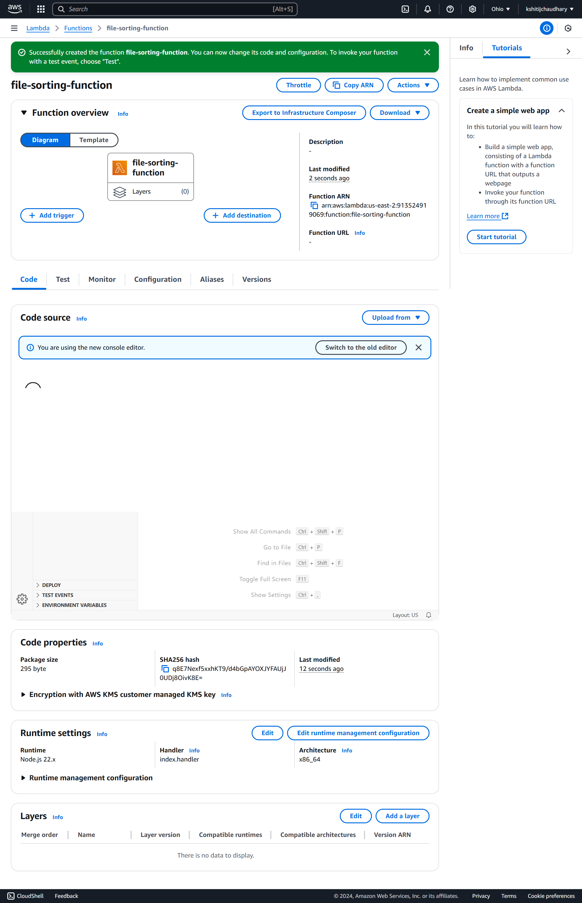
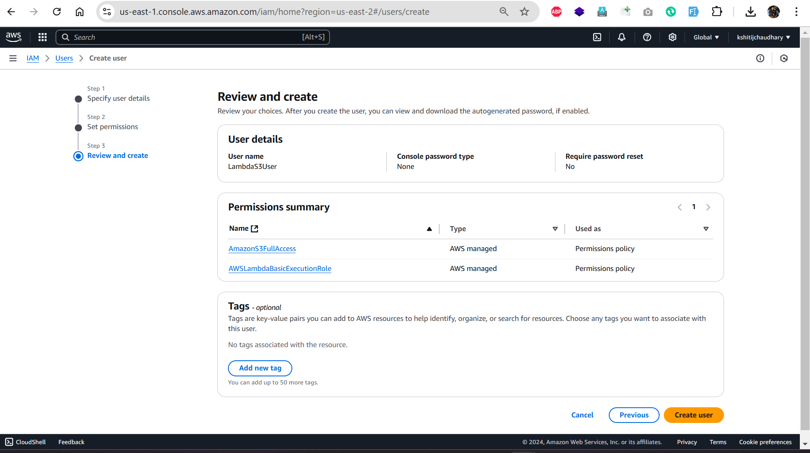
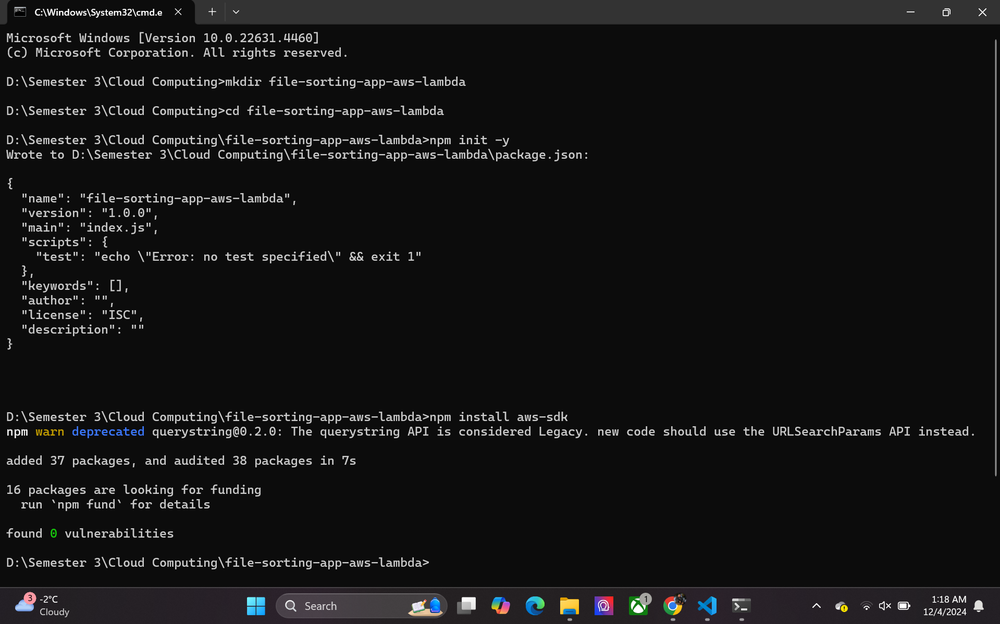
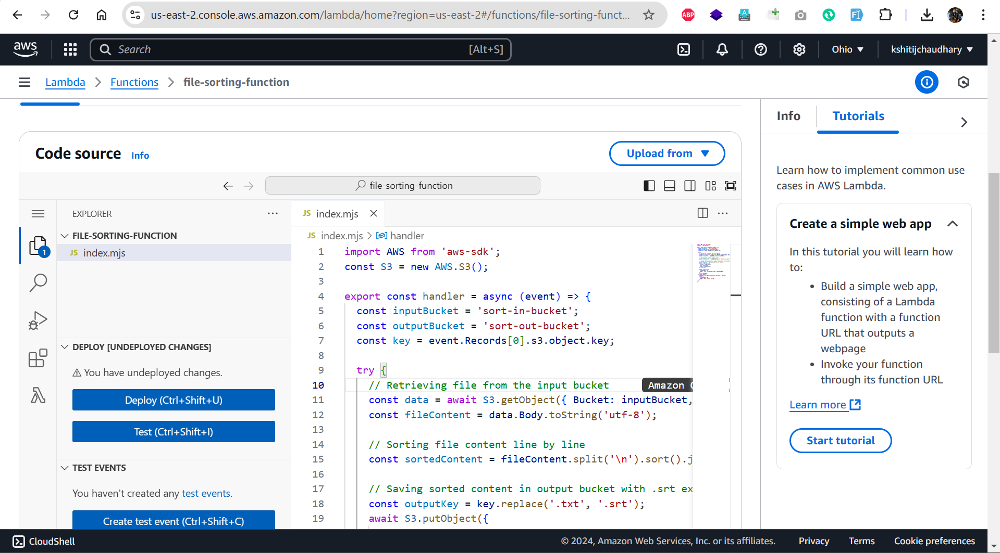

# File Upload and Sorting Web Application

This project implements a web application that allows users to upload `.txt` or `.csv` files, which are then processed by an AWS Lambda function to sort the data. The sorted file is then made available for download from an S3 output bucket.

## Project Overview

This application leverages AWS services like S3 and Lambda for file management and data processing. Users can upload a file, track the progress of the upload and sorting process, and download the sorted file once processing is complete.

### Key Features

- **File Upload:** Allows users to upload `.txt` or `.csv` files through the web interface.
- **Data Sorting:** The file is sorted based on certain criteria using an AWS Lambda function.
- **Progress Tracking:** Displays the upload and sorting progress in real-time.
- **Download Sorted File:** Once the file is processed, the user can download the sorted file.
- **File Validation:** Only `.txt` and `.csv` files are allowed for upload to ensure compatibility with the sorting process.

### Technologies Used

- **Frontend:**
  - HTML
  - CSS (External styles via `styles.css`)
  - JavaScript (AWS SDK for file handling and Lambda invocation)
- **Backend:**
  - **AWS S3:** For storing uploaded and sorted files.
  - **AWS Lambda:** For processing and sorting the uploaded file.
  - **AWS Cognito Identity Pool:** For authenticating and authorizing file uploads.

### AWS Services

- **AWS S3 Buckets:** 
  - `sort-in-bucket`: Stores the uploaded files.
  - `sort-out-bucket`: Stores the processed and sorted files.

    

- **AWS Lambda Function:** `file-sorting-function` sorts the file and places it in the `sort-out-bucket`.

    

- **AWS Cognito:** For authenticating the client app with AWS resources.

    

## Setup Instructions

To set up and run this project locally, follow these steps:

### 1. Clone the Repository
Clone the repository to your local machine:

```bash
git clone https://github.com/your-username/your-repository-name.git
cd your-repository-name
```

### 2. Set Up AWS Services
**Create AWS S3 Buckets:**
`sort-in-bucket` (for uploading files)
`sort-out-bucket` (for storing processed files)

**Create AWS Lambda Function:**
Create a Lambda function (`file-sorting-function`) that sorts the file and places it in the `sort-out-bucket`.

**Create IAM Roles:**
Create IAM roles for AWS Lambda and AWS S3 to allow appropriate permissions for file processing.

**Set Up AWS Cognito:**

Set up a Cognito Identity Pool for authenticating users with the AWS services.

### 3. Run the Application
You can run the project by opening the index.html file in a browser. If you're using a local server, serve the file through it. The app will interact with the AWS services to allow file uploads, sorting, and downloads.


## Project Structure

/project-root
  /index.html             # Main HTML page for file upload and interaction
  /app.js                 # JavaScript file containing app logic
  /styles.css             # Styling for the application
  /.env                   # Environment variables for AWS credentials
  /README.md              # Documentation for the project
  /screenshots            # Folder containing all project-related screenshots

## Detailed Workflow
User Uploads a File: The user selects a .txt or .csv file for upload. The file is validated to ensure it matches the required format. Once selected, the upload button becomes enabled, and the file is uploaded to the sort-in-bucket in AWS S3.


### File Sorting Process: 
Upon successful upload, an AWS Lambda function (file-sorting-function) is triggered. This function processes the file and sorts its data. The sorted data is then stored in the sort-out-bucket.


### Progress Display: 
During the upload and processing steps, the user is shown a progress bar indicating the status of the upload and the sorting process.


### File Download:
 Once the file is sorted, the user can download the processed file by clicking the download button. The sorted file is made available via a signed URL from AWS S3, allowing secure download access.

## Screenshots

### Pages
### Homepage


### Choosing File From Device


### Uploading And Sorting File


### Displaying Sorted File


### Downloading Sorted File


### 1. Lambda Function Execution
Showcase the Lambda function working in the AWS Management Console to demonstrate file processing.

Description: This screenshot highlights how the Lambda function processes an uploaded file, showing logs of its execution.
Screenshot:
2. AWS Setup
a. S3 Bucket Configuration
Show the sort-in-bucket and sort-out-bucket settings, including folder structure (unsorted/ and sorted-unsorted/).

Description: Input and output S3 bucket configuration to show the folder hierarchy.
Screenshot:
b. Cognito Identity Pool Setup
Show the configuration of your Cognito Identity Pool for authentication.

Description: The Cognito Identity Pool setup with access permissions for S3 buckets.
Screenshot:
c. Lambda Function Setup
Show the Lambda function setup, including environment variables, execution role, and trigger configuration.

Description: Lambda function configuration screen.
Screenshot:
3. Code Snippets
Show snippets of the code used in the project for context.

a. Lambda Function Code
Show the core Lambda function logic.

Description: The Python code for the Lambda function used to process and sort the files.
Screenshot:
b. Frontend Code
Show a snippet of the app.js file that handles file uploads and displays progress.

Description: JavaScript file for the frontend logic.
Screenshot
## Screenshots

### Aws Lambda Function Created



### Buckets

### Adding Permissions To Role


### Checking In Log Events


### Creating Lambda Function


### Creating User Pool


### Creating Aws Lambda Function


### Creating Iam User Roles


### Creating Iam User


### Creating Identity Pool


### Creating Lambda Project


### Creating S3 Unauth Policy


### Creating Sort In Bucket


### Creating Sort Out Bucket


### Creating Trigger For Sort In


### Deploying Aws Lambda Function


### Getting Updated File In Sort Out Bucket


### Lambda Review Page


### Resource Based Policy


### Role Summary Page


### Selecting Lambda As Trusted Entity


### Setting Automatic Trigger


### Setting Bucket Policy


### Setting Sort In Bucket Trigger


### Sort In Bucket File


### Sort Out Bucket File


### Testing Lambda Function


### Uploading In Sorted Bucket


### Uploading Unsorted File In Sort In Bucket


### Writing Aws Lambda Function

