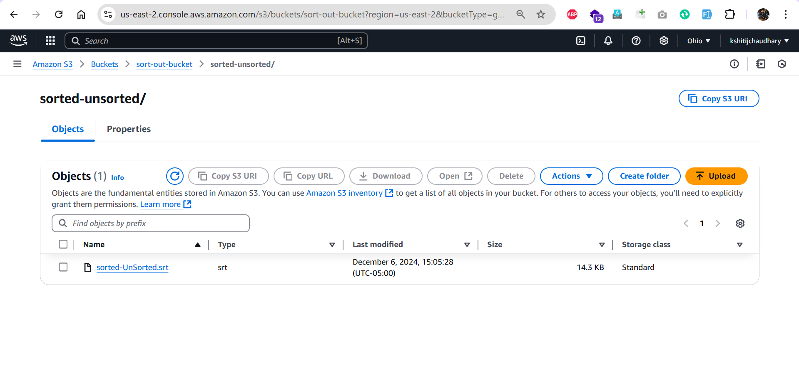
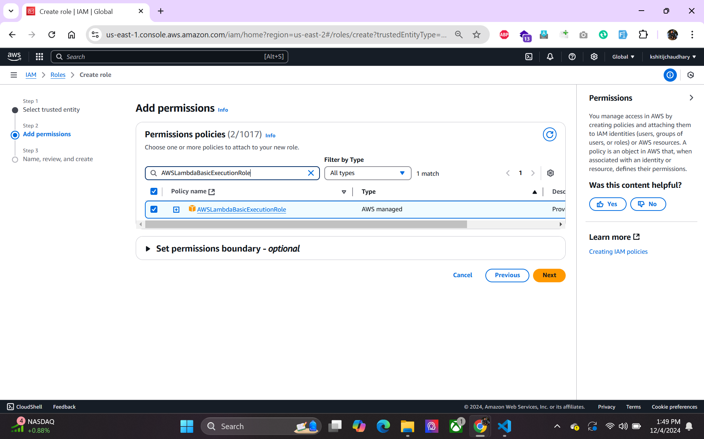
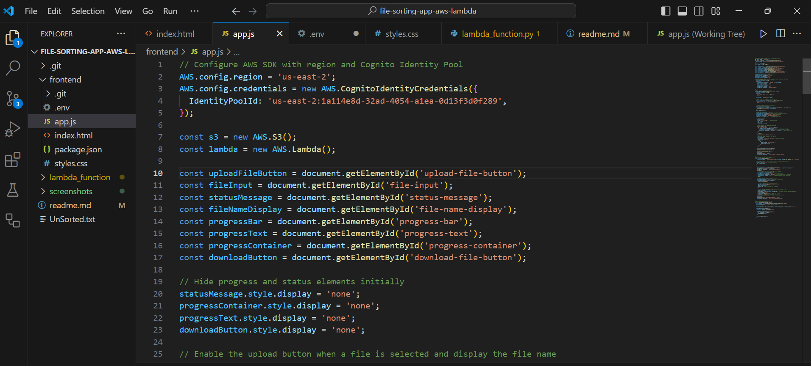

# File Upload and Sorting Web Application

This project implements a web application that allows users to upload `.txt` or `.csv` files, which are then processed by an AWS Lambda function to sort the data. The sorted file is then made available for download from an S3 output bucket.

## Project Overview

This application leverages AWS services like S3 and Lambda for file management and data processing. Users can upload a file, track the progress of the upload and sorting process, and download the sorted file once processing is complete.

### Key Features

- **File Upload:** Allows users to upload `.txt` or `.csv` files through the web interface.
- **Data Sorting:** The file is sorted based on certain criteria using an AWS Lambda function.
- **Progress Tracking:** Displays the upload and sorting progress in real-time.
- **Download Sorted File:** Once the file is processed, the user can download the sorted file.
- **File Validation:** Only `.txt` and `.csv` files are allowed for upload to ensure compatibility with the sorting process.

### Technologies Used

- **Frontend:**
  - HTML
  - CSS (External styles via `styles.css`)
  - JavaScript (AWS SDK for file handling and Lambda invocation)
- **Backend:**
  - **AWS S3:** For storing uploaded and sorted files.
  - **AWS Lambda:** For processing and sorting the uploaded file.
  - **AWS Cognito Identity Pool:** For authenticating and authorizing file uploads.

### AWS Services

- **AWS S3 Buckets:** 
  - `sort-in-bucket`: Stores the uploaded files.
  - `sort-out-bucket`: Stores the processed and sorted files.

- **AWS Lambda Function:** `file-sorting-function` sorts the file and places it in the `sort-out-bucket`.

- **AWS Cognito:** For authenticating the client app with AWS resources.

## Setup Instructions

To set up and run this project locally, follow these steps:

### 1. Clone the Repository

Clone the repository to your local machine:

```bash
git clone https://github.com/kshitijchaudhary/lambda-file-sorting-app.git
cd lambda-file-sorting-app
Run Using Live Browser to test with link: http://127.0.0.1:5500/frontend/index.html
```

## Setup AWS Services

Before running the application, you need to set up the necessary AWS services. Follow the instructions below:

### 1. Create AWS S3 Buckets
You need to create two S3 buckets in AWS to manage file uploads and processed files.

- **sort-in-bucket:** This bucket will store the uploaded files.
- **sort-out-bucket:** This bucket will store the processed and sorted files.

To create the S3 buckets:

1. Go to the [AWS S3 Console](https://console.aws.amazon.com/s3/).
2. Click on **Create bucket**.
3. Name your buckets as `sort-in-bucket` and `sort-out-bucket` accordingly.
4. Choose the region and configure other settings as needed.
5. Click **Create bucket**.

### 2. Create AWS Lambda Function

Create a Lambda function that will process and sort the files uploaded to the `sort-in-bucket` and place the sorted files into the `sort-out-bucket`.

To create the Lambda function:

1. Go to the [AWS Lambda Console](https://console.aws.amazon.com/lambda/).
2. Click **Create function**.
3. Select **Author from scratch** and name the function `file-sorting-function`.
4. Choose a runtime as Python
5. In the function code, include the logic to sort the uploaded file based on your criteria.
6. Under **Permissions**, assign the function an IAM role that allows access to the S3 buckets.

### 3. Create IAM Roles

Create IAM roles for AWS Lambda and AWS S3 to allow appropriate permissions for file processing.

1. Go to the [AWS IAM Console](https://console.aws.amazon.com/iam/).
2. Create an IAM role for AWS Lambda with permissions to access the S3 buckets (`sort-in-bucket` and `sort-out-bucket`).
3. Create another IAM role for S3 with permissions to allow file uploads and downloads.
4. Attach the roles to the Lambda function and the S3 buckets.

### 4. Set Up AWS Cognito

AWS Cognito will be used to authenticate users and allow them to upload files.

1. Go to the [AWS Cognito Console](https://console.aws.amazon.com/cognito/).
2. Create a new **Identity Pool**.
3. Enable **Unauthenticated identities**.
4. Assign appropriate IAM roles to authenticate users with the S3 service.

## Run the Application

Once the AWS services are set up, you can run the project locally. Follow these steps:

1. **Open the `index.html` file** in a web browser.
   - You can either open the file directly in your browser or run it on a local server (e.g., using `Live Server` in VS Code).
   
2. **Interacting with AWS Services:**
   - The app will interact with the AWS S3 buckets, Lambda function, and Cognito for authentication.
   - Users can upload `.txt` or `.csv` files, track the upload and sorting progress, and download the sorted file once processing is complete.

Once the application is running, you will be able to interact with the system and utilize AWS services for file uploads, sorting, and downloads.


## Project Structure

The project is organized into the following structure:

/file-sorting-app-aws-lambda
│
├── frontend/
│   ├── index.html          # Main HTML page for file upload and interaction
│   ├── app.js              # JavaScript file containing app logic
│   └── styles.css          # Styling for the application
│
├── lambda_function/
│   └── lambda_function.py  # Python code for the AWS Lambda function
│
├── .env                    # Environment variables for AWS credentials
├── README.md               # Documentation for the project
└── screenshots/            # Folder containing all project-related screenshots

---

## Detailed Workflow

The application follows these steps to allow users to upload, process, and download files:

### 1. User Uploads a File
- The user selects a `.txt` or `.csv` file to upload.
- The selected file is validated to ensure it matches the required format.
- Once the file is validated, the **upload button** is enabled, allowing the user to initiate the upload process.
- The file is then uploaded to the `sort-in-bucket` in AWS S3.

### 2. File Sorting Process
- Upon successful upload, an **AWS Lambda function** (`file-sorting-function`) is triggered automatically.
- The Lambda function processes and sorts the file based on predefined criteria (e.g., sorting data alphabetically or numerically).
- The sorted file is then stored in the `sort-out-bucket` in AWS S3.

### 3. Progress Display
- During both the upload and sorting steps, the user is shown a **progress bar** indicating the status of the file upload and sorting process.
- The progress bar updates in real-time, providing feedback to the user on the ongoing task.

### 4. File Download
- Once the file has been successfully sorted, the user can click the **download button** to retrieve the processed file.
- The sorted file is made available via a **signed URL** from AWS S3, providing secure and controlled access for downloading the file.

---

This workflow ensures that users can easily upload files, track the progress of the sorting process, and download the final sorted file with minimal interaction.

## Screenshots

### Pages

#### Homepage


#### Choosing File From Device


#### Uploading And Sorting File


#### Displaying Sorted File


#### Downloading Sorted File


#### Handling Errors
**Trying to Upload a File with a Different Extension Than `.txt` or `.csv`**


---

## A. Lambda Function Execution

### Creating AWS Lambda Function


### Lambda Function Created


### Deploying AWS Lambda Function


### Testing Lambda Function


---

## B. AWS Setup

### a. S3 Bucket Configuration

#### Creating Sort In Bucket


#### Creating Sort Out Bucket


#### Buckets


#### Creating Trigger For Sort In


#### Setting Automatic Trigger


#### Setting Sort In Bucket Trigger


#### Sort In Bucket File


#### Sort Out Bucket File


#### Uploading Unsorted File In Sort In Bucket


#### Getting Updated File In Sort Out Bucket


#### Setting Bucket Policy


#### Checking In Log Events


---

### C. Cognito Identity Pool Setup
**Description:** The Cognito Identity Pool setup with access permissions for S3 buckets.

#### Creating Identity Pool


---

### D. Execution Roles

#### Creating IAM User Roles


#### Selecting Lambda As Trusted Entity


#### Adding Permissions To Role


#### Creating S3 Unauth Policy


#### Lambda Review Page


#### Role Summary Page


#### Resource-Based Policy


---

## E. Code Snippets
Snippets of the code used in the project for context.

**a. Lambda Function Code**
**Description**: The Python code for the Lambda function used to process and sort the files.
**Code:**
```bash
import json
import boto3

s3 = boto3.client('s3')

def lambda_handler(event, context):
    # Define your bucket names
    input_bucket = 'sort-in-bucket'
    output_bucket = 'sort-out-bucket'
    
    # If the event comes from an S3 trigger (uploaded file), process it
    if 'Records' in event:
        try:
            # Get the file details from the S3 event
            file_key = event['Records'][0]['s3']['object']['key']
            
            # Check if the file is under the 'unsorted/' folder in the input bucket
            if not file_key.startswith('unsorted/'):
                raise Exception('File is not in the expected "unsorted/" folder.')

            # Retrieve the file content from the input bucket
            file_obj = s3.get_object(Bucket=input_bucket, Key=file_key)
            file_content = file_obj['Body'].read().decode('utf-8')
            
            # Split the content by newlines and sort it
            sorted_content = '\n'.join(sorted(file_content.split('\n')))
            
            # Extract the filename (without the folder path)
            file_name = file_key.split('/')[-1]

            # Ensure we replace .txt with .srt
            if file_name.endswith('.txt'):
                output_key = f'sorted-unsorted/sorted-{file_name.replace(".txt", ".srt")}'
            else:
                output_key = f'sorted-unsorted/sorted-{file_name}.srt'  # Fallback in case it's not a .txt file
            
            # Upload the sorted file to the output bucket
            s3.put_object(Bucket=output_bucket, Key=output_key, Body=sorted_content)
            
            # Return a success message
            return {
                'statusCode': 200,
                'body': json.dumps(f'Successfully sorted and uploaded to {output_bucket}/{output_key}')
            }
        
        except Exception as e:
            # Handle any errors that occur during the process
            return {
                'statusCode': 500,
                'body': json.dumps(f'Error processing file {file_key}: {str(e)}')
            }
    
    # If the event is coming from a direct invocation (e.g., API Gateway or other sources)
    elif 'key' in event:
        try:
            file_key = event['key']
            
            # Check if the file is under the 'unsorted/' folder in the input bucket
            if not file_key.startswith('unsorted/'):
                raise Exception('File is not in the expected "unsorted/" folder.')

            # Retrieve the file content from the input bucket
            file_obj = s3.get_object(Bucket=input_bucket, Key=file_key)
            file_content = file_obj['Body'].read().decode('utf-8')
            
            # Split the content by newlines and sort it
            sorted_content = '\n'.join(sorted(file_content.split('\n')))
            
            # Extract the filename (without the folder path)
            file_name = file_key.split('/')[-1]

            # Ensure we replace .txt with .srt
            if file_name.endswith('.txt'):
                output_key = f'sorted-unsorted/sorted-{file_name.replace(".txt", ".srt")}'
            else:
                output_key = f'sorted-unsorted/sorted-{file_name}.srt'  # Fallback in case it's not a .txt file
            
            # Upload the sorted file to the output bucket
            s3.put_object(Bucket=output_bucket, Key=output_key, Body=sorted_content)
            
            # Return a success message
            return {
                'statusCode': 200,
                'body': json.dumps(f'Successfully sorted and uploaded to {output_bucket}/{output_key}')
            }
        
        except Exception as e:
            # Handle any errors that occur during the process
            return {
                'statusCode': 500,
                'body': json.dumps(f'Error processing file {file_key}: {str(e)}')
            }
    else:
        return {
            'statusCode': 400,
            'body': json.dumps('Bad Request: Missing file key')
        }

```


**b. Frontend Code**
**Description:** JavaScript file for the frontend logic.
Screenshot
## Screenshots
**Index.js File**

**App.js File**

**Styles.css file**

**Lambda Function File**


